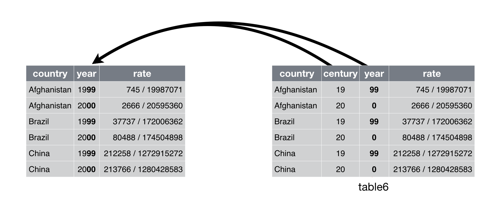

```{r setup, include=FALSE}
knitr::opts_chunk$set(echo = TRUE)#, 
                      #fig.height = 3, 
                      #fig.width  = 6,
                      #fig.align  = "center")
```

# Learning Objectives

- Identify tidy and non-tidy data
- Learn to make your data tidy: 

    - “Pivotting” which converts between long and wide forms with `pivot_longer()`, `pivot_wider()`
    - Splitting and combining character columns:
    
        - Use `separate()` and `extract()` to pull a single character column into multiple columns; 
        - use `unite()` to combine multiple columns into a single character column.
    - Make implicit missing values explicit with complete()
    - Make explicit missing values implicit with values_drop_na()
    - Replace missing values with next/previous value with fill(), or a known value with replace_na()
 
# Resources
 
- Chapter 12 of [RDS](https://r4ds.had.co.nz/tidy-data.html)
- [Data Import Cheat Sheet](https://github.com/rstudio/cheatsheets/blob/master/data-import.pdf)
- [Article by Hadley Wickham](http://vita.had.co.nz/papers/tidy-data.pdf)
- [Tidyr Vignette](https://tidyr.tidyverse.org/articles/pivot.html)
- [Pivot Vignette](https://tidyr.tidyverse.org/articles/pivot.html)
- [Separate Vignette](https://tidyr.tidyverse.org/reference/separate.html)
- [Unite Vignette](https://tidyr.tidyverse.org/reference/unite.html)

# Tidy Data

- Recall:

    - Observations/units/subjects/individuals/cases:
      objects described by a set of data (e.g. cars, people, countries).
    - Variable: describes some characteristic of the units (e.g. mpg, age, GDP).
    - Each unit has a single value of each variable (e.g. 20 mpg, 31 years old, 
      $20,513,000 US$million).

- Tidy Data:

    - One observation per row.  
    - One variable per column.
    - One value per cell.
    
- Hadley's visualization:

    \ 

    
- We will use the tidyr package (a member of the tidyverse) to make data
  tidy.

    ```{r library_tidyverse, message = FALSE}
    library(tidyverse)
    ```


- Frequent Characteristics of "Nontidy" Data

    - Column headers are values, not variable names.
    - Multiple variables are stored in one column.
    - Variables are stored in both rows and columns.
    - Multiple types of observational units are stored in the same table.
    - A single observational unit is stored in multiple tables.


Look at table1, table2, table3, table4a, table4b.  Which one is tidy?  Why?

It is easy to analyze and plot your data with tidy data .... is why it is called the tidyverse.

    ```{r tidytables}
    table1
    table2
    table3
    table4a
    table4b
    # rate per 10,000
    table1 %>%
      mutate(rate = cases/population*10000)
    # cases per year
    table1 %>%
      count(year, wt=cases)
    ```


```{r plot_try}
table1 %>% ggplot(aes(x = year, y = cases, color = country)) +
  geom_line() +
  geom_point()
```

- Example of tidy data:

    ```{r print_table1}
    tidyr::table1
    ```
    
    - Variables: Country, Year, Cases, Population
    - Units: location$\times$time

- Untidy data: Each observational unit is spread across multiple rows

    ```{r print_table2}
    print(tidyr::table2, n = 12)
    ```
    
- Untidy data: Two variables are in one column

    ```{r print_table3}
    tidyr::table3
    ```
    
- Untidy data: Data are spread across two data frames. Within each data frame,
  multiple observations are in one row.

    ```{r print_table4}
    tidyr::table4a
    tidyr::table4b
    ```
    
- Sometimes it is easy to determine the units and the variables.

- Sometimes it is very hard and you need to talk to the data collectors to 
  find out.
  
- We want tidy data because R easily manipulates vectors. So in the long run 
  it will make your life easier to first make data tidy.

- **Exercise 1** The following built-in datasets are not tidy.  For each one, describe why it is not tidy and write out what the first five entries would look like once it is in a tidy format. 

  a. relig_income
  b. billboard
  c. us_rent_income
  
------------------------------------------------------------------

# intro to pivot_longer and pivot_wider

## When one variable spread across multiple columns, use `pivot_longer()`

- Column names are actually *values* of a variable

- `table4a` and `table4b`

- Solution: `pivot_longer()`

- Hadley's visualization:

    \ 

- Specify

    i. The columns that are values, not variables,
    ii. The name of the variable that will take the values of the column names 
        (`names_to`), and
    iii. The name of the variable that will take the values spread in the cells 
         (`values_to`).

    ```{r pivot_longer_4a}
    table4a
    tidy4a <- table4a %>%
      pivot_longer(cols = c(`1999`,`2000`), names_to = "year", 
                   values_to = "cases")
    ```

- **Exercise 2** Try on your own to do the same thing to table4b.  We will learn next class how to join these two data frames next week. But the code is
    ```{r tidytable4b, echo = FALSE}
    tidy4b <- table4b %>%
      pivot_longer(cols = c(`1999`,`2000`), names_to = "year", 
                       values_to = "population")
    ```

    ```{r join_4a_4b}
    full_join(tidy4a, tidy4b)
    ```

- **Exercise 3**: Tidy built-in dataset relig_income

    ```{r tidy_relig_inc, echo = FALSE}
    relig_income %>% 
      pivot_longer(cols = -religion, names_to = "income",
               values_to = "count")
    ```

- **Exercise 4**: gather the `monkeymem` data frame (also available at
  https://dcgerard.github.io/stat_412_612/data/monkeymem.csv). The cell 
  values represent identification accuracy of some objects (in percent of 20 
  trials).

    ```{r exercise4soln, echo=FALSE}
    monkeymem <- read_csv("./Data/monkeymem.csv")
    monkeymem %>%
      pivot_longer(cols = starts_with("Week"),
                   names_to = "Week", 
                   values_to = "Percent")
    ```
    
## When an observation is scattered over multiple rows, use `pivot_wider()`

- `pivot_wider()` makes a dataset wider by increasing the number of columns and decreasing the number of rows. 

- One of the columns contains the *names* of the variables

- `table2` 

- Solution: `pivot_wider()`

- Hadley's visualization:

    \ 

- Specify

    i. The column from which to pull the variable names (`names_from`),
    ii. The column from which to get the associated values of the variables.
    

    ```{r pivot_wider_table2}
    table2
    table2 %>% pivot_wider(names_from = type, values_from = count)
    ```

- **Exercise 5**: Tidy the fish_encounters dataset of fish spotting by monitoring stations. Make the NA into 0 using the option values_fill = list(seen = 0) 

    ```{r tidy_fish2, echo = FALSE}
    fish_encounters %>% pivot_wider(
      names_from = station,
      values_from = seen,
      values_fill = list(seen = 0)
      )
    ```

- **Exercise 6**: Spread the `flowers1` data frame (also available at
  https://dcgerard.github.io/stat_412_612/data/flowers1.csv). Hint: use `read_csv2()` to read in the dataset.

    ```{r spread_flowers1, echo = FALSE}
    flowers1 <- read_csv2("./Data/flowers1.csv")
    flowers1 %>%
      pivot_wider(names_from = Variable, values_from = Value)
    ```
    

-----------------------------------------------------

# separate and unite functions

## `separate()` splits a column into multiple columns. 

- Problem: One column contains two (or more) variables.

- `table3`

- Solution: `separate()`

- Hadley's visualization:

    \
    
- Specify:

    i. The column that contains two (or more) variables,
    ii. A character vector of the new names of the variables, and
    iii. The character that separates variables (or the position that
         separates variables) The default is the first non-numeric character.
         
    ```{r tidytable3}
    table3
    table3 %>%
        separate(rate, into = c("cases","population"))
    table3 %>%
      separate(rate, into = c("cases","population"), sep="/")
    table3 %>%
      separate(
        rate, 
         into = c("cases","population"),
         convert = TRUE  # to convert to numeric if desired
       )
    table5 <- table3 %>%
      separate(year, into=c("century", "year"), sep=2)
    ```


- **Exercise 7:** Tidy the dataset flowers2.csv (also available at
  https://dcgerard.github.io/stat_412_612/data/flowers2.csv ) by turning the one column into 3 separate columns.  
  
    ```{r exercise7_soln, echo=FALSE}
    flowers2 <- read_csv("./Data/flowers2.csv")
    flowers2_sep <- flowers2  %>% separate(
      col = `Flowers/Intensity;Time`, 
      into = c("Flowers", "Intensity;Time"), 
      sep = "/") %>%
      separate(
        col = `Intensity;Time`, 
        into = c("Intensity", "Time"), 
        sep = ";")
    flowers2_sep
    ```

## unite is the inverse of separate()

- Problem: One variable spread across multiple columns.

- Solution: `unite()`

- Hadley's visualization:

    \
    
- Much less common problem.
    ```{r unite}
    table5 %>% unite(new, century, year)
    table5 %>% unite(new, century, year, sep = "")
    ```
    
- **Exercise 8**: Re-unite the data frame you separated from the `flowers2` 
  exercise. Use a comma for the separator.
  
    ```{r unite_flowers, echo = FALSE}
    flowers2_sep %>%
      unite(Flowers, Intensity, col = "Flowers,Intensity", sep = ",")
    ```
-------------------------------------------------------------

# Dealing with Missing Values

Two types of missing values:

- explicitly missing (NA) 
- implicitly missing (just row missing)

## Make NA's explicit using `complete()`

First we will look at ways to make a missing row explicit 
The `complete()` function  fills in NA's where needed so each combination of columns is in the output
    ```{r complete}
    stocks <- tibble(
      year   = c(2015, 2015, 2015, 2015, 2016, 2016, 2016),
      qtr    = c(   1,    2,    3,    4,    2,    3,    4),
      return = c(1.88, 0.59,  0.35,  NA,  0.92, 0.17, 2.66)
    )
    stocks
    stocks %>%
      complete(year,qtr)
    ```
  
Here is a tibble where the item_id and item_name go together and we need to have all items showing for each group.  
    ```{r implicit_missing}
    df <- tibble(
      group = c(1:2, 1),
      item_id = c(1:2, 2),
      item_name = c("a", "b", "b"),
      value1 = 1:3,
      value2 = 4:6
    )
    df
    ```
    
Note that there is no row for group 2 with item_id = 1, item_name = a.  We specify that we want to expand the group to accomodate the patterns present in item_id and item_name.  In this case, those are sort of equivalent in that the item_name goes with the item_id.  Since they are equivalent, we use the nesting to tell the code to group those together.  We also used the fill option to specify that missing value1's should be given a 0 rather than an NA.
  
    ```{r fix_implicit_missing}
    df %>% complete(group, nesting(item_id, item_name), 
                    fill = list(value1 = 0))
    ```

- **Exercise 9** In the following dataset, turn the implicit missing values to explicit.

    ```{r find_implicit}
    output <- tibble(
      treatment   = c("a", "b", "a", "c", "b"),
      gender   = factor(c("M", "F", "F", "M", "M"), levels = c("M", "F", "O")),
      return = c(1.5, 0.75,  0.5,  1.8,  NA)
    )
    output
    ```

    ```{r find_implicit_solution, echo = FALSE}
    output %>% complete(treatment, gender) 
    ```
## Make explicit NA's implicit using `values_drop_na`

To turn explicit missing values to implicit missing values, you can use values_drop_na = TRUE as an option to `pivot_longer()`

    ```{r explicit_missing_remove}
    stocks %>%
      pivot_wider(
        names_from = year, 
        values_from = return) %>%
      pivot_longer(
        cols = c(`2015`, `2016`),
        names_to = "year",
        values_to = "return", 
        values_drop_na = TRUE)
    ```

## `fill()`

A similar option uses fill to carry forward the previous value to any missing spots.
    ```{r fill}
    stocks %>%
     fill(return)
    ```

## `replace_na()`

We can also use the `replace_na()` function to replace the NA values in our tibble with other things.

    ```{r replace_na}
    df2 <- df %>% complete(group, nesting(item_id, item_name))
    df2 %>% replace_na(list(value1 = 0, value2 = "unknown"))
    ```
-------------------------------------------------

# `names_pattern()`

- Problem: The value of the variable is part of the column name.

- Solution: `names_pattern()` option of `pivot_longer()`


    ```{r preglook}
    preg <- read_csv("./Data/preg.csv")
    preg
    ```

tidy preg

    ```{r pregtidy}
    preg2 <- preg %>% pivot_longer(
      cols = starts_with("treatment"),
      names_to = "treatment",
      values_to = "result",
      names_pattern = "treatment(.)")

    preg2
    ```

# Multiple variables stored in one column

Look at the built-in dataset who.
    ```{r who_overview}
    who
    ```
Note that country, iso2, iso3, and year are already variables, so they can be left as is. But the columns from new_sp_m014 to newrel_f65 encode four variables in their names:

1.  The new_/new prefix indicates these are counts of new cases. This dataset only contains new cases, so we’ll ignore it here because it’s constant.

2.  The next two letters describe the type of TB:
    
    *   `rel` stands for cases of relapse
    *   `ep` stands for cases of extrapulmonary TB
    *   `sn` stands for cases of pulmonary TB that could not be diagnosed by 
        a pulmonary smear (smear negative)
    *   `sp` stands for cases of pulmonary TB that could be diagnosed be 
        a pulmonary smear (smear positive)

3.  The sixth letter gives the sex of TB patients. The dataset groups 
    cases by males (`m`) and females (`f`).

4.  The remaining numbers gives the age group. The dataset groups cases into     seven age groups:
    
    * `014` = 0 -- 14 years old
    * `1524` = 15 -- 24 years old
    * `2534` = 25 -- 34 years old
    * `3544` = 35 -- 44 years old
    * `4554` = 45 -- 54 years old
    * `5564` = 55 -- 64 years old
    * `65` = 65 or older
    
We can break these variables up by specifying multiple column names in names_to, and then either providing names_sep or names_pattern. Here names_pattern is the most natural fit. It has a similar interface to extract: you give it a regular expression containing groups (defined by ()) and it puts each group in a column.
  
    ```{r separate_who}
    # separate using regular expression
    who_tidy <- who %>% pivot_longer(
      cols = new_sp_m014:newrel_f65,
      names_to = c("diagnosis", "gender", "age"),
      names_pattern = "new_?(.*)_(.)(.*)", # or use names_sep for separator
      values_to = "count"
    )
    head(who_tidy)
    ```

We could go one step further and specify the types of the gender and age columns. This is good practice when you have categorical variables with a known set of values. Let's also get rid of all the NA counts.

    ```{r better_who}
    # separate using regular expression and add types for gender and ordered type for age
    who_tidy <- who %>% pivot_longer(
      cols = new_sp_m014:newrel_f65,
      names_to = c("diagnosis", "gender", "age"),
      names_pattern = "new_?(.*)_(.)(.*)", # or use names_sep for separator
      values_to = "count",
      values_drop_na = TRUE,
      names_ptypes = list(
        gender = factor(levels = c("f", "m")),
        age = factor(
          levels = c("014", "1524", "2534", "3544", "4554", "5564", "65"), 
          ordered = TRUE)
        )
    )
    head(who_tidy)
    ```

# Variables stored in both rows and columns

Get the data and look at it

    ```{r weatherdata}
    weather <- read_csv("./Data/weather.csv")
    head(weather)
    ```

* daily weather data from the Global Historical Climatology Network
* one weather station (MX17004) in Mexico for five months in 2010.
* variables in columns for id, year and month, spread across columns for days of month
* variables spread across rows for minimum and maximum temperatures
* months with fewer than 31 days have structural missing values

Use `pivot_longer()` to put the days all in one column

    ```{r pivot_days}
    weather2 <- weather %>% pivot_longer(
      cols = starts_with("d"),
      names_to = "day",
      values_to = "value",
      names_prefix = "d", # removes the prefix specified
      names_ptypes = list(day = integer()), #sets the value left to be an integer
      values_drop_na = TRUE
    )
    ```

Rearrange the data

    ```{r cleanWeather}
    weather3 <- weather2 %>%
      select(id,year, month, day, element, value) %>%
      arrange(id, year, month, day)
    weather3
    ```

Use pivot_wider to separate tmax and tmin into separate columns

    ```{r spreadweather}
    weather4 <- weather3 %>% pivot_wider(
      names_from = element,
      values_from = value
    )
    head(weather4)
    ```

Look at resulting dataframe

    ```{r sumWeather}
    summary(weather4)
    ```

- **Exercise 10:**

Tidy the billboard dataset (built-in)

*	First gather up all the week entries into a row for each week for each song (where there is an entry)

*	Then, convert the week variable to a number and figure out the date corresponding to each week on the chart

*	Sort the data by artist, track and week.  Here are what your first entries should be (formatting can be different):

```{r billboard_results, results = "asis"}
#>  A tibble: 5,307 x 5
#   artist  track                   date.entered  week  rank   date
 #    <chr>   <chr>                   <date>       <int> <dbl>   <date>
 #  1 2 Pac   Baby Don't Cry (Keep... 2000-02-26       1    87 2000-02-26
 #  2 2 Pac   Baby Don't Cry (Keep... 2000-02-26       2    82 2000-03-04
 #  3 2 Pac   Baby Don't Cry (Keep... 2000-02-26       3    72 2000-03-11
 #  4 2 Pac   Baby Don't Cry (Keep... 2000-02-26       4    77 2000-03-18
 #  5 2 Pac   Baby Don't Cry (Keep... 2000-02-26       5    87 2000-03-25
 #  6 2 Pac   Baby Don't Cry (Keep... 2000-02-26       6    94 2000-04-01
 #  7 2 Pac   Baby Don't Cry (Keep... 2000-02-26       7    99 2000-04-08
 #  8 2Ge+her The Hardest Part Of ... 2000-09-02       1    91 2000-09-02
 #  9 2Ge+her The Hardest Part Of ... 2000-09-02       2    87 2000-09-09
 # 10 2Ge+her The Hardest Part Of ... 2000-09-02       3    92 2000-09-16
 # … with 5,297 more rows
```       

```{r billboard_solution, echo = FALSE}
billboard %>% 
  pivot_longer(
    cols = starts_with("wk"), 
    names_to = "week", 
    names_prefix = "wk",
    names_ptypes = list(week = integer()),
    values_to = "rank",
    values_drop_na = TRUE,
  ) %>% 
  mutate(date = date.entered + (week - 1)*7) %>%
  arrange(artist, track, week) %>%
  select(-date.entered)
```
------------------------------------------

# Multiple observations per row

You can usually recognise this case because the name of the column that you want to appear in the output is part of the column name in the input.

```{r family_setup}
family <- tribble(
  ~family,  ~dob_child1,  ~dob_child2, ~gender_child1, ~gender_child2,
       1L, "1998-11-26", "2000-01-29",             1L,             2L,
       2L, "1996-06-22",           NA,             2L,             NA,
       3L, "2002-07-11", "2004-04-05",             2L,             2L,
       4L, "2004-10-10", "2009-08-27",             1L,             1L,
       5L, "2000-12-05", "2005-02-28",             2L,             1L,
)
family <- family %>% mutate_at(vars(starts_with("dob")), parse_date)
family
```
Note that we have two pieces of information (or values) for each child: their gender and their dob (date of birth). These need to go into separate columns in the result. Again we supply multiple variables to names_to, using names_sep to split up each variable name. Note the special name .value: this tells pivot_longer() that that part of the column name specifies the “value” being measured (which will become a variable in the output).

```{r tidy_family}
family %>% 
  pivot_longer(
    -family, 
    names_to = c(".value", "child"), 
    names_sep = "_", 
    values_drop_na = TRUE
  )
```

- **Exercise 11:**  Do the same with the built-in dataset anscombe

```{r anscombe, echo = FALSE}
anscombe
anscombe %>% 
  pivot_longer(everything(), 
    names_to = c(".value", "set"), 
    names_pattern = "(.)(.)"
  ) %>% 
  arrange(set)
```

- **Exercise 12:**  Tidy the world_bank_pop dataset

```{r world_bank_pop, echo = FALSE}
world_bank_pop
# first let's gather up the years 
pop2 <- world_bank_pop %>% 
  pivot_longer(`2000`:`2017`, names_to = "year", values_to = "value")
pop2
# Next we need to consider the indicator variable:
pop2 %>% count(indicator)
pop3 <- pop2 %>% 
  separate(indicator, c(NA, "area", "variable"))
pop3
# complete the tidying by pivoting variable and value
# to make TOTL and GROW columns:
pop3 %>% 
  pivot_wider(names_from = variable, 
              values_from = value)
```

# Specification by hand

Sometimes we want to be more specific in our tidying format than the standard inputs provide.  Look at the built-in construction dataset. 
```{r construction}
construction
```

We would like to have columns for units and one for region.

```{r hand_spec}
spec <- tribble(
  ~.name,            ~.value, ~units,  ~region,     
  "1 unit",          "n",     "1",     NA,          
  "2 to 4 units",    "n",     "2-4",   NA,          
  "5 units or more", "n",     "5+",    NA,          
  "Northeast",       "n",     NA,      "Northeast", 
  "Midwest",         "n",     NA,      "Midwest",   
  "South",           "n",     NA,      "South",     
  "West",            "n",     NA,      "West",      
)
pivot_longer_spec(construction, spec)
```
The pivotting spec allows us to be more precise about exactly how pivot_longer(df, spec = spec) changes the shape of df: it will have nrow(df) * nrow(spec) rows, and ncol(df) - nrow(spec) + ncol(spec) - 2 columns.
